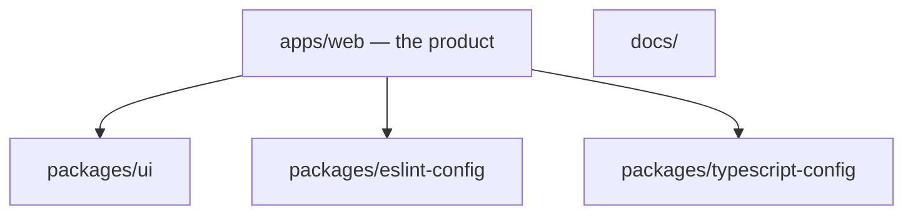
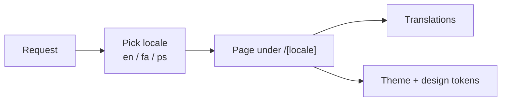

# Architecture

One Next.js app in a small monorepo. Shared packages are for config and UI we might reuse later.



Inside `apps/web`, a request goes:



## Commands

```bash
pnpm dev --filter=web
pnpm build
pnpm lint
pnpm check-types
```
